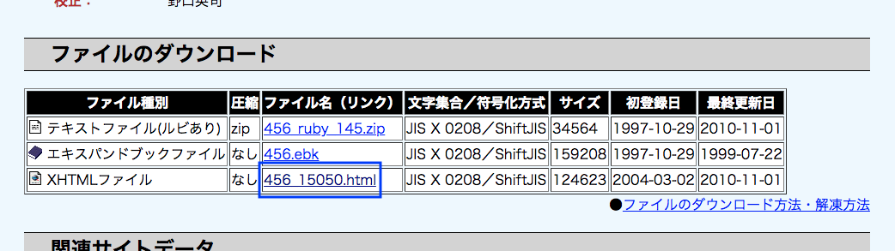

# Aozora lorem

The fake text generator using [Aozora Bunko](https://www.aozora.gr.jp/). This makes better "ここにテキストが入ります".

Inspired by [faker.js](https://github.com/Marak/faker.js).

## Install

```bash
npm install @yuheiy/aozora-lorem
```

## Usage

```js
const pug = require('pug')
const { loadBook } = require('@yuheiy/aozora-lorem')

loadBook('https://www.aozora.gr.jp/cards/000081/files/456_15050.html').then(
  ({ lorem }) => {
    const html = pug.render('p= lorem.paragraph()', { lorem })
    // "<p>「おっかさんは、ぼくをゆるして下さるだろうか。」</p>"
  },
)
```

## API

### `loadBook(url)`

Load data from Aozora Bunko and returns an instance of `book`. Specify the URL of the book's XHTML file as an argument.

[](https://www.aozora.gr.jp/cards/000081/card456.html)

```js
const { loadBook } = require('@yuheiy/aozora-lorem')

loadBook('https://www.aozora.gr.jp/cards/000081/files/456_15050.html').then(
  (book) => {
    book.lorem.paragraph()
  },
)
```

### `book.lorem.content`

An array containig all of the content.

```js
book.content
// [
//   "一、午后の授業",
//   "「ではみなさんは、そういうふうに川だと云われたり、乳の流れたあとだと云われたりしていたこのぼんやりと白いものがほんとうは何かご承知ですか。」先生は、黒板に吊した大きな黒い星座の図の、上から下へ白くけぶった銀河帯のようなところを指しながら、みんなに問をかけました。",
//   "カムパネルラが手をあげました。それから四五人手をあげました。ジョバンニも手をあげようとして、急いでそのままやめました。たしかにあれがみんな星だと、いつか雑誌で読んだのでしたが、このごろはジョバンニはまるで毎日教室でもねむく、本を読むひまも読む本もないので、なんだかどんなこともよくわからないという気持ちがするのでした。",
//   ...
// ]
```

### `book.lorem.paragraph()`

Returens a paragraph at random.

```js
book.lorem.paragraph()
// "「いま誰もいないでわかりません。あしたにして下さい。」"
```

### `book.lorem.paragraphs(lines = random(1, content.length))`

Returns paragraphs of the specified number of lines at random. By default the number of lines is random.

```js
book.lorem.paragraphs(3)
// [
//   "ジョバンニが云いました。",
//   "「銀河ステーションで、もらったんだ。君もらわなかったの。」",
//   "「ああ、ぼく銀河ステーションを通ったろうか。いまぼくたちの居るとこ、ここだろう。」"
// ]
```

## License

The license for this software is MIT.

[Details of the license for Aozora Bunko is here](https://www.aozora.gr.jp/guide/kijyunn.html).
